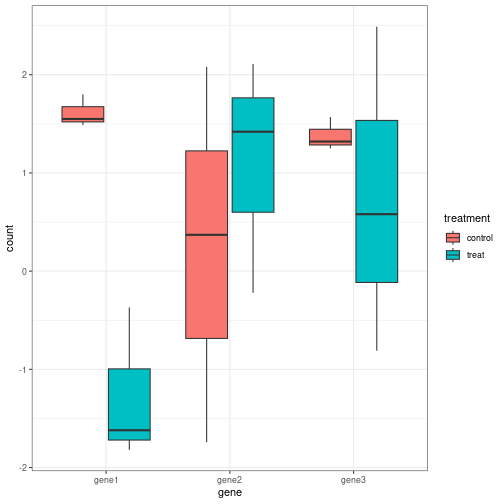
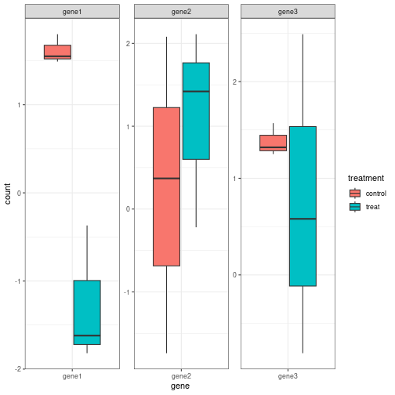

# 原始数据格式

为了方便，我们来“捏造”一个表达矩阵

```r
set.seed(10086)
exp = matrix(rnorm(18), ncol = 6)
exp = round(exp, 2)  # 四舍五入，保留两位小数
rownames(exp) = paste0('gene', 1:3)  # 给矩阵来个 行 名
colnames(exp) = paste0('test', 1:6)  # 给矩阵来个 列 名
exp[, 1:3] = exp[, 1:3] + 1  # 前三列每个元素都加1，人为制造差异
exp
```

```
##       test1 test2 test3 test4 test5 test6
## gene1  1.55  1.49  1.80 -0.37 -1.82 -1.62
## gene2 -1.74  0.37  2.08  2.11 -0.22  1.42
## gene3  1.57  1.25  1.32  2.49  0.58 -0.81
```

# 格式转换

因为ggplot在画图时要求数据格式为数据框，还要求在映射中输入列名，但上面产生的矩阵并不符合这些要求，所以我们需要对数据进行转换

先载入格式转换时常用的R包

```r
library(tidyr)
library(tibble)
library(dplyr)
```

对exp转置，并转换为数据框

```r
t_dat = as.data.frame(t(exp))
t_dat
```

```
##       gene1 gene2 gene3
## test1  1.55 -1.74  1.57
## test2  1.49  0.37  1.25
## test3  1.80  2.08  1.32
## test4 -0.37  2.11  2.49
## test5 -1.82 -0.22  0.58
## test6 -1.62  1.42 -0.81
```

```r
dim(t_dat)
```

```
## [1] 6 3
```

把t_dat的行名作为一列添加到t_dat中，需要用到 `rownames_to_column()` 函数，这个函数的语法为：`rownames_to_column(.data, var = "rowname")` 从中可知添加的列名默认为rowname

```r
t_dat = rownames_to_column(t_dat)
t_dat
```

```
##   rowname gene1 gene2 gene3
## 1   test1  1.55 -1.74  1.57
## 2   test2  1.49  0.37  1.25
## 3   test3  1.80  2.08  1.32
## 4   test4 -0.37  2.11  2.49
## 5   test5 -1.82 -0.22  0.58
## 6   test6 -1.62  1.42 -0.81
```

```r
dim(t_dat)
```

```
## [1] 6 4
```

再给t_dat新增一列，列名为treatment，以区分对照和实验组，当然实际操作中要根据具体情况进行设置


```r
final_t_dat = mutate(t_dat, treatment = rep(c("control", 'treat'), each = 3))
final_t_dat
```

```
##   rowname gene1 gene2 gene3 treatment
## 1   test1  1.55 -1.74  1.57   control
## 2   test2  1.49  0.37  1.25   control
## 3   test3  1.80  2.08  1.32   control
## 4   test4 -0.37  2.11  2.49     treat
## 5   test5 -1.82 -0.22  0.58     treat
## 6   test6 -1.62  1.42 -0.81     treat
```

```r
dim(final_t_dat)
```

```
## [1] 6 5
```

将数据框由短边长，说白了就是把含有gene的那一列给合并到一起，需要用到 `pivot_longer` 函数。

```r
long_dat = pivot_longer(final_t_dat,
                        cols = starts_with('gene'),
                        names_to = 'gene',
                        values_to = 'count')
head(long_dat,6)
```

```
## # A tibble: 6 × 4
##   rowname treatment gene  count
##   <chr>   <chr>     <chr> <dbl>
## 1 test1   control   gene1  1.55
## 2 test1   control   gene2 -1.74
## 3 test1   control   gene3  1.57
## 4 test2   control   gene1  1.49
## 5 test2   control   gene2  0.37
## 6 test2   control   gene3  1.25
```

```r
dim(long_dat)
```

```
## [1] 18  4
```
代码说明：

1. `cols = starts_with('gene')` 中的 `starts_with()` 是一个函数，用来选择以某个pattern开头的字符串。故这一句代码的总体含义为从final_t_dat数据框中选出以gene开头的列，把这些列的内容合并为一列，作为新产生的数据框的一列

2. `names_to = 'gene'` 指定上一步新产生的列名为 gene

3. `values_to = 'count'` 把final_t_dat中gene的数据信息一一对应的合并到一起，作为新产生的数据框的一列，列名为 count

# 画箱线图

```r
library(ggplot2)
p = ggplot(long_dat, mapping = aes(x = gene, y = count))+
  geom_boxplot(aes(fill = treatment))+
  theme_bw()
p
```



再给图片分个面

```r
p+
  facet_wrap(~ gene, scales = 'free')
```


